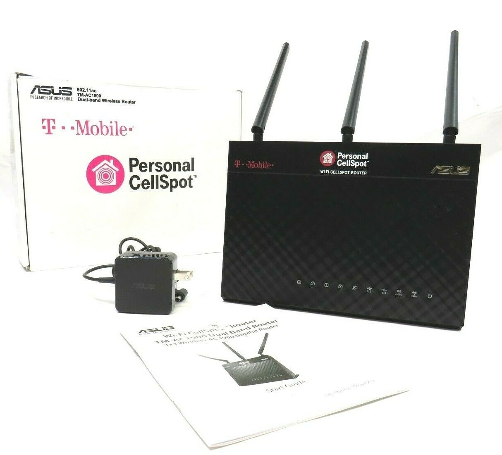
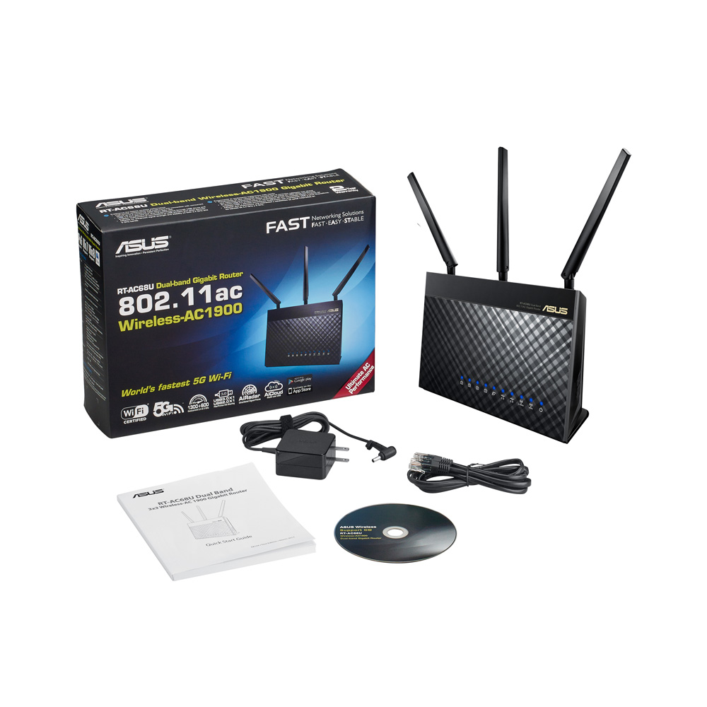
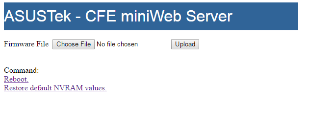

<h1 align="center">
Asus TM-AC1900 to RT-AC68U
</h1>

<h3>
The T-Mobile Asus TM-AC1900 Dual Band Wireless Router is an abandoned WiFi 5 router that has the same hardware as the ASUS RT-68U, a router that features Asus's AiMesh ability.
  
<br>
<br>

The RT-AC68U goes for between $80 refurbished and $110 to $130 new.  The TM-AC1900 however goes for $30 to $35 on Ebay in new condition.  A firmware conversion will change a TM-AC1900 into an RT-AC68U.

<table align="center">
<tbody>
<tr>
<td><figure align="center">

<figcaption align = "center">Asus TM-AC1900</figcaption>
</figure>
</td>
<td><figure align="center">

<figcaption align = "center">Asus RT-AC68U</figcaption>
</figure>
</td>
</tr>
</tbody>
</table>

---

<h2>

Process adapted from this <a href="https://moreless.medium.com/flash-tm-ac-1900-to-rt-ac68u-to-use-aimesh-80b84387358a">Medium post</a>. I followed this successfully on 7/20/2022.

</h2>

---

<h2>Download firmware and tools.</h2>

<br>

Download TM-AC1900toRT-AC68U.7z from <a href="https://mega.nz/file/jAEi0S5S#JvWZ0s9G4pwMLpaIW8jQ_q-Zd8MBdihch3ZSSAs8Vs0">here</a>.  This contains 3 files.

<code>TM-AC1900_3.0.0.4_376_1703-g0ffdbba.trx</code> is for downgrading the current firmware to allow for ssh.

<code>mtd-write</code> is tool for changing the bootloader and firmware.

<code>FW_RT_AC68U_30043763626.trx</code> is the firmware that makes the TM-AC1900 a RT-AC68U.

<br>

Extract the files to somewhere you can easily use secure copy (scp) from. I used my Downloads folder which I mounted as a Linux drive.
<br>
<h2>Enable SSH</h2>
<br>
The TM-AC1900 most likely comes with a firmware version that has disabled SSH.

The router will not let you simply downgrade the firmware.  It needs to be put into rescue mode.

<br>


    1. Hold the reset button for 10 seconds.
    2. Power off the TM-AC1900 while still holding the reset button.
    3. Wait 10 seconds while continuing to hold the reset button.
    4. Turn the TM-AC1900 on and continue to hold the reset button for another 10 seconds
    5. Power LED at the front panel flashes slowly, which indicates that the wireless router is in the rescue mode


<br>

Connect to the router in recovery mode.


    1. Connect your computer by ethernet to the router
    2. Setup your computer to use a static IPv4 address of 192.168.29.5 subnet mask 255.255.255.0.
    3. Open a web browser.
    4. Navigate to 192.168.29.1.


<br>

The page should look like below.
<br>

<p  align="center">

</p>

<br>

Choose <code>TM-AC1900_3.0.0.4_376_1703-g0ffdbba.trx</code> as the file and click upload.

<br>

After the flash finishes and the router reboots, refresh the web page at 192.168.29.1.

I had to go through the initial setup to set an admin password (set it to something simple) as the default wasn't working for me.  I left it as a router.  You can set it up as an access point but the IP address and subnet mask need to be manually set.

<br>

In the web GUI, got Administration > System.

Click to enable SSH and apply.

<br>

<h2>SSH into the router</h2>

<br>

To SSH into the router with your client of choice.  I used a chromebook with Linux setup.

I opened a terminal and type <code>ssh ```admin@192.168.29.1```</code>.

This will most likely give you an error, <code>Unable to negotiate with 192.168.29.1 port 22: no matching key exchange method found. Their offer: diffie-hellman-group1-sha1.</code>

This means diffie-hellman-group1-sha1 key exchange needs to be added to <code>/etc/ssh/ssh_config</code> or where ever appropriate for your SSH client.

For me, I installed the nano text editor by typing <code>sudo apt install nano</code>.

Then edited the <code>ssh_config</code> file by typing <code>sudo nano /etc/ssh/ssh_config</code>.

At the end of the file, I added


    KexAlgorithms +diffie-hellman-group1-sha1


This line should be removed after completing the upgrade, since it is a legacy key exchange.

<br>
If successful, enter the password for admin set earlier.

You will get a prompt that looks like

    admin@(none):/tmp/home/root#

<br>

First thing to do is make a copy of the bootloader sfe. Enter

    cat /dev/mtd0 > original-cfe.bin

This take the output of <code>cat /dev/mtd0</code> and saves it in <code>original-cfe.bin</code> located at /tmp/home/root/.

<br>

Next, I opened a new terminal on the chromebook.  Now to copy the <code>original-cfe.bin</code> to a local drive.

I mounted the Downloads folder to <code>/mnt/chromeos/MyFiles/</code>.

Type

    scp admin@192.168.29.1:/tmp/home/root/original_cfe.bin /mnt/chromeos/MyFiles/Downloads/

<br>

Open a web browser on the local machine and go to https://cfeditor.pipeline.sh/.

<br>

Upload <code>original-cfe.bin</code>, select 1.0.2.0 US AiMesh (RT-AC68U), and download Target CFE to the Downloads folder.

Change the name to <code>new-cfe.bin</code>.

<br>

Back in the terminal local to the chromebook (not the one SSH into the router), copy 3 files to the router.

    scp /mnt/chromeos/MyFiles/Downloads/new_cfe.bin admin@192.168.29.1:/tmp/home/root/
    scp /mnt/chromeos/MyFiles/Downloads/mtd-write admin@192.168.29.1:/tmp/home/root/
    scp /mnt/chromeos/MyFiles/Downloads/FW_RT_AC68U_30043763626.trx admin@192.168.29.1:/tmp/home/root/

<br>

Switch to the terminal that is SSH into the router.

<code>mtd-write</code> needs to be made executable.

    chmod u+x mtd-write

Next update the bootloader.

    ./mtd-write new_cfe.bin boot

Finally, add the new firmware.

    mtd-write2 FW_RT_AC68U_30043763626.trx linux


<br>

Perform an NVRAM reset.

    1. Turn off router.
    2. Wait for 10 seconds.
    3. Press and hold WPS button.
    4. Power up the router and continue to hold WPS button for 15–20 seconds until power LED starts blinking very quickly.

<br>

The router is now a RT-AC68U with a default address 192.168.1.1/24 but the firmware cannot be upgrade until the mtd5 partition is removed.

I needed to go back through setup and enable SSH.

SSH into the router.


    ssh admin@192.168.1.1


<br>

Input the following,


    cat /dev/mtd5 > /jffs/mtd5_backup.bin
    mkdir /tmp/asus_jffs
    mount -t jffs2 /dev/mtdblock5 /tmp/asus_jffs
    rm -rf /tmp/asus_jffs/*
    sync && umount /tmp/asus_jffs
    rm -rf /jffs/.sys/RT-AC68U
    nvram unset fw_check && nvram commit && reboot


<br>

Now the firmware can be upgraded through the web GUI.
